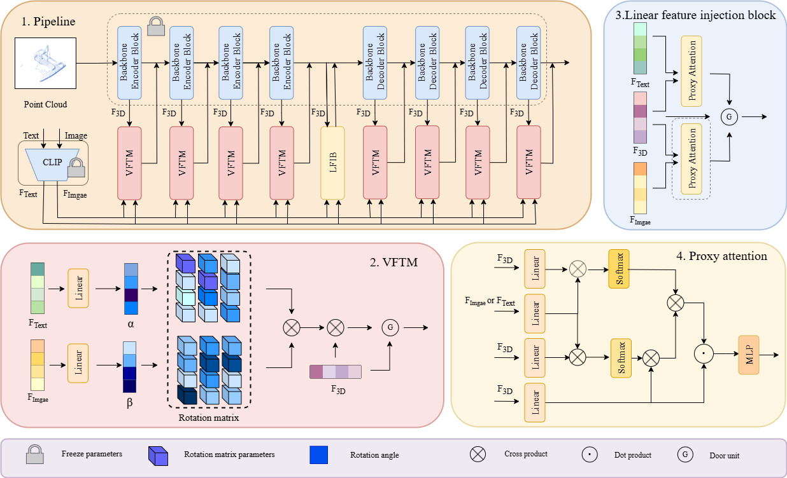

# M-Adapter: A general framework for constructing and fine-tuning 3D multimodal large models via Feature Vector Fields

  

## News

- [Coming Soon] Open the source code of M-Adapter🚀🚀
- [Coming Soon] Open the source code of M-Adapter🚀🚀
- [2025/04] 📢✨Our article has been submitted to TVCG! 
- [2025/04] 🔥🔥Our code link has been released!

## Acknowledgements
Parts of the code are taken or adapted from the following repos:
- [PoinTr](https://github.com/yuxumin/PoinTr)
- [AnchorFormer](https://github.com/chenzhik/AnchorFormer)
- [SHS-Net](https://github.com/LeoQLi/SHS-Net)

